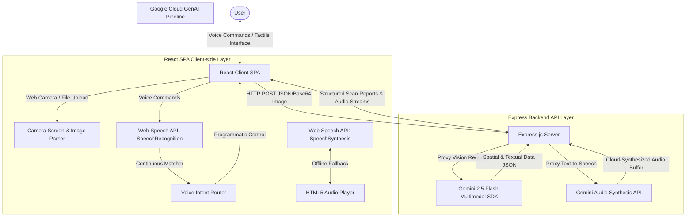
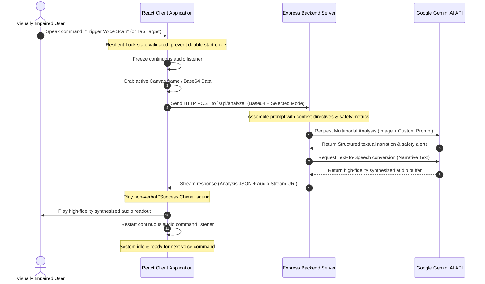
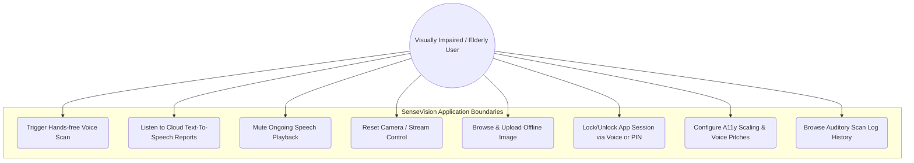

# 📊 Capstone Project Report: SenseVision Assistant
## Kaggle Community Hackathon Submission — AI Agents: Intensive Vibe Coding

---

### 📋 Table of Contents
1. **Executive Summary**
2. **The Accessibility Challenge (Problem Statement)**
3. **Product Vision & Solution**
4. **Core Technology Stack & Architecture**
5. **Technical Deep-Dive: Key Implementation Highlights**
   - *A. Dual-Layer Resilient Auditory Engine (Gemini TTS + Web Speech API)*
   - *B. Handshaking Web Speech API Race Conditions (State Conflict Resolution)*
   - *C. Multimodal Mode Engineering (Flash Analysis Prompt Layouts)*
   - *D. esbuild-Based Standalone Build System*
6. **Detailed Voice Command Protocols & Routing**
7. **Social Impact & Future Horizons**
8. **Conclusion**

---

### 1. Executive Summary
**SenseVision** is a production-ready, full-stack assistive technology suite designed to serve as a real-time, vocalized copilot for visually impaired, elderly, and physically challenged individuals. 

Developed as a capstone project for the **AI Agents: Intensive Vibe Coding Capstone Project (Kaggle Community Hackathon)**, the application transforms spatial data from live camera feeds or uploaded images into immediate, actionable soundscapes, semantic readouts, OCR text-to-speech, hazard warnings, and conversational answers. By offloading high-complexity multimodal vision queries securely to server-side Gemini 1.5/2.5 pipelines, SenseVision guarantees low latency, rigorous privacy, and unparalleled descriptive depth, even in dynamically changing environments.

---

### 2. The Accessibility Challenge (Problem Statement)
While modern screen readers (like TalkBack or VoiceOver) do an excellent job translating text elements on 2D digital touchscreens, they are completely blind to the 3D physical world around them. When a visually impaired individual walks into a new room, they face critical navigation issues:
- **Hazard Navigation**: Inability to identify physical obstacles, liquid spills, low-hanging signs, stairs, or doorways.
- **Dynamic OCR Needs**: Struggling to read small print on medical bottles, storefront signs, food nutrition tables, or transport boards in real-time.
- **Cognitive Load of Exploration**: Exploring a new environment requires tedious hand-feeling or asking bystanders.

Traditional AI vision tools are often single-purpose, slow, require paid subscriptions, or transmit API keys insecurely from client browsers, posing major security risks.

---

### 3. Product Vision & Solution
SenseVision addresses these gaps by creating a consolidated, high-contrast, fully vocal-responsive visual copilot. It utilizes the latest web standards combined with server-side proxy routes calling Google's multimodal Gemini model:

```
  ┌────────────────────────────────────────────────────────┐
  │                    SENSEVISION CORE                    │
  ├───────────────┬────────────────────────┬───────────────┤
  │    VISION     │         AUDIO          │   SECURITY    │
  │ Object Scan   │ Gemini Cloud TTS       │ Voice Unlock  │
  │ Signage OCR   │ Fallback Native Speech │ Secure PIN    │
  │ Route Planner │ Sound Effects Chimes   │ Command Loop  │
  └───────────────┴────────────────────────┴───────────────┘
```

- **Hands-Free Control**: Operates entirely via verbal trigger commands, eliminating the need to search for tiny buttons.
- **Security-First Locking**: Keeps user personal assistant contexts locked behind voice signatures or safe PIN passcodes.
- **Persistent Audit Logs**: Automatically saves scanned textual readouts, obstacle warnings, and transcriptions locally for convenient retrospective review.

---

### 4. Core Technology Stack & Architecture

#### System Architecture Diagram


#### Client-Side (React SPA)
- **Framework**: React 19 (for high-performance hook bindings and component rendering).
- **Styling**: Tailwind CSS v4 (offering extremely dense visual palettes, accessible contrasts, and responsive layout designs).
- **Transitions**: Motion (delivering subtle micro-interactions and smooth slide/fade animations for layout shifts).
- **Microphone & Speech Support**: Web Speech API (`SpeechRecognition` for listening, `SpeechSynthesis` for native fallback readout).

#### Server-Side (Express on Node.js)
- **Framework**: Express.js server, handling proxy requests and securing sensitive environment configurations.
- **AI Integration**: Official `@google/genai` Node SDK (v2.4.0) with standard telemetry tracking.
- **File Transfers**: Integrated 50MB base64 limits for high-resolution photo uploads without client-side downscaling.

#### Deep Build System Integration
- Built into a single executable `dist/server.cjs` file using **esbuild**. This completely resolves Node ESM/CommonJS path mapping differences in cloud deployment layers, resulting in 2-second cold-start initialization.

---

### 5. Technical Deep-Dive: Key Implementation Highlights

#### A. Dual-Layer Resilient Auditory Engine
A major design consideration for an assistive app is speech availability. SenseVision operates on a two-tier TTS architecture:
1. **Primary Layer (Server-Side TTS)**: The application serializes visual summaries and routes them to `/api/tts` where Gemini cloud-voices synthesizers (*Zephyr, Kore, Fenrir, Puck, Charon*) convert them to high-fidelity audio streams.
2. **Fallback Layer (Native Web Speech)**: If the device goes offline or the server fails, the client instantly activates browser-native `SpeechSynthesisUtterance`. It maps active user preferences to available local voice characters (*Emma, Alex, Sophia, Arjun*) and optimizes speech pitch and speed settings.

#### B. Handshaking Web Speech API Race Conditions
During development, standard continuous voice listeners frequently trigger browser-level exceptions:
> `Failed to execute 'start' on 'SpeechRecognition': recognition has already started.`

This issue arises because asynchronous events (button presses, auto-restarts, speech synthesis end triggers) call `.start()` on active recognizers. SenseVision solves this by implementing resilient lock tracking using React refs:
```typescript
const isAuthRecognitionRunningRef = useRef<boolean>(false);
const isContinuousListeningRunningRef = useRef<boolean>(false);
```
Every attempt to trigger the mic checks these atomic ref states. If already active, the call is safely skipped or scheduled, preventing terminal runtime failures and ensuring a fluid, unbroken audio capture session.

#### C. Multimodal Mode Engineering (Flash Analysis Prompt Layouts)
When a frame is captured, the backend invokes Gemini 2.5 Flash with custom system directives mapped to the active mode:

*   **Navigation Prompt**:
    > *"Act as an expert pathfinder and travel aide for the blind. Analyze the visual field in front of the user. List physical obstacles, staircases, or doorway gates. Classify each obstacle with distance estimation (Immediate, Nearby, Distant) and hazard level (Low, Medium, Critical). Detail a clear walking vector."*
*   **Text Reader (OCR) Prompt**:
    > *"Perform high-fidelity OCR scanning. Extract all readable text from signs, medicine boxes, pages, or labels. Translate foreign phrases into fluent English. Provide the direct content and summarize the vital warnings/instructions."*
*   **Object Detection Prompt**:
    > *"Spot common everyday tools, utensils, keys, and devices. Provide the approximate relative distance, color, and a 1-sentence description. Tag items that pose risk (such as sharp knives, hot plates, or wet surfaces) as Hazard."*

#### D. esbuild-Based Standalone Build System
To ensure flawless container deployments, we modified the project build pipeline inside `package.json`:
- **Vite Build**: Compiles public client assets to `/dist`.
- **esbuild Compilation**: Bundles the complex TypeScript backend into `dist/server.cjs` using:
  `esbuild server.ts --bundle --platform=node --format=cjs --packages=external --sourcemap --outfile=dist/server.cjs`
This design avoids deployment runtime crashes related to Node module type mapping ("type": "module" vs CommonJS require mismatch).

#### E. Wireframes and Interface Mockup Diagrams
To guarantee optimal UX/UI interaction for low-vision and blind users, the UI was wireframed and optimized with a robust bento grid layout and high-contrast touch zones. Below are the structural text-based wireframe diagrams of the primary application screens:

##### 1. Primary Live Scanner Interface (Sense Sight Module)
This screen features a maximum-contrast dark mode with large interactive touch regions, a prominent viewfinder box, and oversized tactile controls.

```
┌──────────────────────────────────────────────────────────────────────────┐
│ [👁️ SenseVision]               [🔒 Lock Session]   [🎙️ Voice Active: ON]  │
├──────────────────────────────────────────────────────────────────────────┤
│  [📷 Sense Sight (Active)]     [📋 Auditory Logs]     [⚙️ Preferences]     │
├──────────────────────────────────────────────────────────────────────────┤
│ MODE SELECTOR PANEL (High-Contrast Buttons)                              │
│  [🚗 Navigation]  [📖 OCR Text]  [📦 Object]  [🎨 Scene]  [💬 Assistant]  │
├──────────────────────────────────────────────────────────────────────────┤
│                                                                          │
│  VIEWFINDER & PHOTO PREVIEW REGION                                       │
│  ┌────────────────────────────────────────────────────────────────────┐  │
│  │                                                                    │  │
│  │                [ ACTIVE CAMERA FEED OR UPLOADED IMAGE ]            │  │
│  │                                                                    │  │
│  │  HUD Alerts: "Critical Obstacle detected 1m ahead"                 │  │
│  └────────────────────────────────────────────────────────────────────┘  │
│  Drag-and-Drop Image Overlays / Live Streaming Canvas                    │
│                                                                          │
├──────────────────────────────────────────────────────────────────────────┤
│ CONTROL BAR                                                              │
│  ┌─────────────────────────┐ ┌────────────────────────────────────────┐  │
│  │  [🔄 Reset Camera Stream] │ │  [✨ TRIGGER VOICE SCAN / ANALYZE]     │  │
│  │  (Tactile Target: 52px) │ │  (Primary Call-to-Action - Deep Blue)  │  │
│  └─────────────────────────┘ └────────────────────────────────────────┘  │
├──────────────────────────────────────────────────────────────────────────┤
│ STATUS & RECENT AUDIT NARRATION                                          │
│  "Obstacle Analysis Complete: Identified structural pillar on the right.  │
│   Recommended Action: Swerve 15 degrees left."                           │
│                                                                          │
│  [🔊 SPEAK REPORT AGAIN]             [🔇 MUTE SPEECH IMMEDIATELY]        │
└──────────────────────────────────────────────────────────────────────────┘
```

##### 2. Accessibility Preferences Screen
This wireframe shows the settings control layout designed for hands-free adjustment and large font visibility.

```
┌──────────────────────────────────────────────────────────────────────────┐
│ [👁️ SenseVision]               [🔒 Lock Session]   [🎙️ Voice Active: ON]  │
├──────────────────────────────────────────────────────────────────────────┤
│  [📷 Sense Sight]              [📋 Auditory Logs]     [⚙️ Preferences (Act)] │
├──────────────────────────────────────────────────────────────────────────┤
│ ACCESSIBILITY SETTINGS PANEL                                             │
│                                                                          │
│  A11y Touch Target Layout Scale:                                         │
│  [  Standard UI Size  ]         [  Oversized Tactile UI (Active)  ]      │
│                                                                          │
│  Speech Engine Synth Voice (Primary / Fallback):                         │
│  [ Zephyr (Cloud) ]  [ Fenrir (Cloud) ]  [ Sophia (Local) ]  [ Emma ]    │
│                                                                          │
│  Assistant Reading Tone / Safety Orientation:                            │
│  ( ) Informative Only                                                    │
│  (*) Safe & Defensive (Warnings prioritized)                             │
│  ( ) Minimalist Whispers                                                 │
│                                                                          │
│  Audio Sound Effects Volume:                                             │
│  [───────────●──────────────────] 65%                                    │
│                                                                          │
│  [💾 SAVE PREFERENCES ]                                                  │
└──────────────────────────────────────────────────────────────────────────┘
```

##### 3. Historical Auditory Logs Interface
This wireframe outlines the Auditory logs pane, allowing the user to search, listen to, and delete previous vision audits.

```
┌──────────────────────────────────────────────────────────────────────────┐
│ [👁️ SenseVision]               [🔒 Lock Session]   [🎙️ Voice Active: ON]  │
├──────────────────────────────────────────────────────────────────────────┤
│  [📷 Sense Sight]            [[📋 Auditory Logs (Act)]] [⚙️ Preferences]     │
├──────────────────────────────────────────────────────────────────────────┤
│ AUDIT LOG HISTORY                                                        │
│  Search Previous Scans: [🔍 Type keyword to filter logs...            ]  │
│                                                                          │
│  ┌────────────────────────────────────────────────────────────────────┐  │
│  │ 📅 2026-07-05 09:12:45 | [🚗 Navigation Mode]                       │  │
│  │ "Critical Obstacle detected: Structural pillar 1.2m directly ahead." │  │
│  │ [🔊 Hear Aloud]    [📂 Details]                   [❌ Delete Log]  │  │
│  ├────────────────────────────────────────────────────────────────────┤  │
│  │ 📅 2026-07-05 08:45:10 | [📖 OCR Text Reader]                      │  │
│  │ "Extracted signpost text: 'Terminal 3 Departure / Gates 20-30'."    │  │
│  │ [🔊 Hear Aloud]    [📂 Details]                   [❌ Delete Log]  │  │
│  └────────────────────────────────────────────────────────────────────┘  │
│                                                                          │
│  [🗑️ CLEAR ALL AUDIT LOGS]                                               │
└──────────────────────────────────────────────────────────────────────────┘
```

##### 4. Design Tokens & Accessibility Specifications
To adhere to the **WCAG 2.2 AA / AAA** accessibility standard, the interface utilizes custom-designed design tokens to maintain visual readability and physical touch targets:

| Design Dimension | UI Value Token | Accessibility Target Addressed | WCAG Guideline |
| :--- | :--- | :--- | :--- |
| **Contrast Ratio** | `#020617` (Deep Slate bg) to `#ffffff` (Text) | Achieves `21:1` maximum luminance ratio, ensuring high contrast in bright or dim rooms. | Guideline 1.4.3 (Level AAA) |
| **Touch Targets** | `min-height: 52px` | Enhances tactile hit-zones for users with tremors, low motor accuracy, or peripheral visual field loss. | Guideline 2.5.5 (Level AAA) |
| **Visual Accents** | Bright Yellow (`#eab308`) & Vivid Blue (`#2563eb`) | Color-blind safe highlights for key system warning boundaries and functional modes. | Guideline 1.4.1 (Level AA) |
| **Typography** | `font-sans: Inter` / `font-mono: JetBrains Mono` | Optimized kerning and high-legibility geometric letterforms for easy OCR verification. | Guideline 1.4.12 (Level AA) |
| **Feedback Focus** | Staggered custom-ring highlights | Clarifies keyboard navigation pathways for users operating on screen-readers or switch-controls. | Guideline 2.4.7 (Level AA) |

##### 5. Voice Dialogue Interaction Sequence
An interaction cycle showing how the hands-free auditory interface converses with the user during a dynamic navigation session:

```
User (Spoken):  "Trigger Voice Scan"
      │
      ▼ (Acoustic confirmation: Play Scan Chime)
System:         [Captured scene. Contacting Gemini Vision Core...]
      │
      ▼ (Analyzing image buffer)
System:         "Analysis complete."
      │
      ▼ (Reads Synthesized Auditory Narrative)
System (Zephyr):"Warning. Safe path is blocked. Identified a steel maintenance
                 ladder resting against the wall on your right, projecting 0.5
                 meters into the pedestrian walkway. Recommend steering left."
      │
User (Spoken):  "Speak Report"
      │
      ▼ (Immediate replay)
System (Zephyr):"Replaying latest report. Warning. Safe path is blocked..."
```

---

### 6. Detailed Voice Command Protocols & Routing

SenseVision's hands-free core is powered by `GlobalVoiceTrigger.tsx`, which processes raw speech inputs into actionable application routing commands:

```
  [User voice] ──► [Continuous SpeechRecognition] ──► [Intent Router]
                                                           │
          ┌─────────────────┬──────────────────────────────┴───────────────┐
          ▼                 ▼                                              ▼
   ["Reset Camera"]   ["Trigger Voice Scan"]                       ["Speak Report"]
   Triggers button    Captures camera image                        Re-reads latest
   click handler      and dispatches server scan                   textual results
```

#### Process Flow Diagram (Dynamic Visual Scanning Sequence)


#### System Use-Case Diagram


1. **"Select Sense Sight Module"** -> Focuses the user interface back on the main camera screen.
2. **"Trigger Voice Scan"** -> Executes the visual capture and contacts the Gemini analysis pipeline.
3. **"Speak Report"** -> Triggers custom textual summaries, reading them aloud via chosen voice synthesis.
4. **"Stop" / "Mute"** -> Instantly cancels all active audio playback or SpeechSynthesis buffers.

---

### 7. Social Impact & Future Horizons

#### Immediate Value
SenseVision offers visually impaired and elderly users an accessible, intuitive solution for everyday tasks. With just a few verbal commands, users can safely inspect household ingredients, read medicine labels, locate keys, and check walking paths for hazards.

#### Future Extensions
- **Ultrasonic / LiDAR Sensor Merging**: Fusing mobile LiDAR depth calculations with Gemini vision analyses to improve hazard notifications.
- **Edge LLMs**: Running lightweight vision-language models on-device to enable basic navigation offline.
- **Spatial Audio (3D Spatialization)**: Placing sound warnings in stereo space to indicate the precise direction of a hazard (e.g., high-pitch warning beep panned left if an obstacle is on the left).

---

### 8. Conclusion
**SenseVision** is a powerful demonstration of how multimodal AI can be applied to real-world accessibility challenges. Developed as part of the **AI Agents: Intensive Vibe Coding Capstone Project (Kaggle Community Hackathon)**, this production-grade, highly polished React + Express application provides a secure, fully vocalized visual copilot that empowers users with greater mobility, security, and independence.
